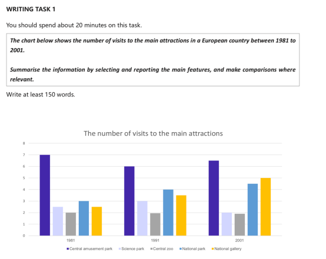
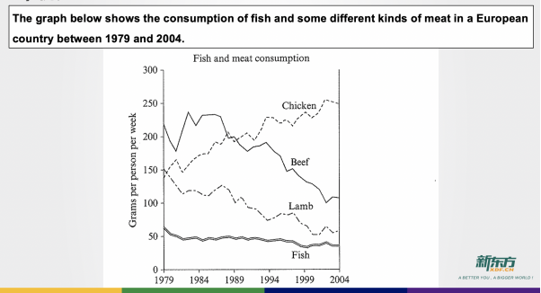
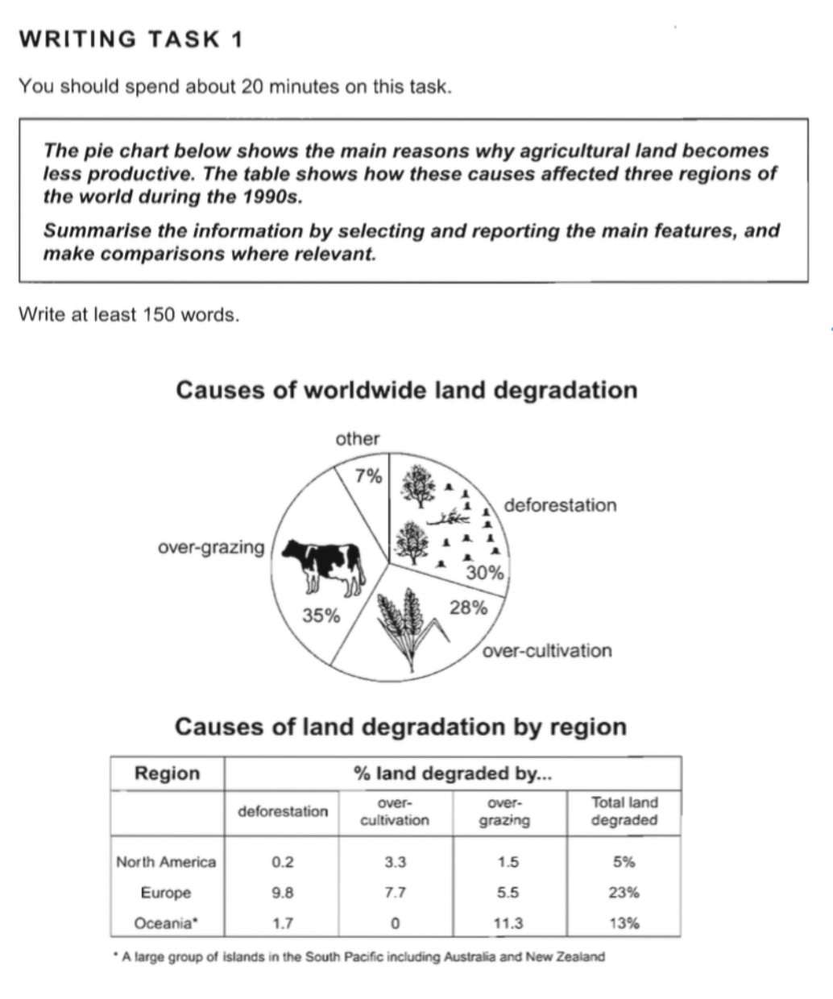

[TOC]

# Task1

---

## Task1 写作任务

1. **summarise** the information 总结信息
2. select and report  the **main features** 具体描写
3. make **comparisons** where relevant 分析对比

## Task1 前准备

### TA

7分:present a **clear**  overview of **main trends**,**differences** or **stages**

### TR

use a **sufficient** range of vocabulary to allow some **flexibility and precision**

### Task1 必备词-趋势描述

|上升 v.|increase,rise,grow,climb,soar,rocket|n. an increase,a rise, growth,climb|
|---|---|---|
|下降v.|decrease,drop,fall,decline,reduce|n. a decrease,fall,drop,reduction,decline|
|持平 v.|stay/keep/remain+stable/steady/constant||
|波动 v.|fluctuate between A and B|a flucuation|

### Task1 必备词-变化幅度

||n.+adj.|v.+adv.|
|---|---|---|
|快(>45)|sharp,dramatic,considerable,significant|sharply,dramatically,considerably,significantly|
|稳定(35-45)|steady,gradual,moderate,modest|steadily,+y|
|慢(<30>)|slow,slight,marginal,mild,minimal|+ly|

约数：
about,around,approximately,nearly,roughly
just under/below,just over/above

## Task1 开头段

The chart below(句首) shows the number of visitors for five kinds of tourism attractions in a European city(内容) in 1981,1991,2001(时间).

1. 改句首
    1. chart变为具体的图表类型
        - bar/line/flow chart
        - table
        - map
    2. below 去掉
    3. shows 改为indicates 或 illustrates
2. 改时间
    - 各自年份
        - 不改
        - in three different/separate years:A B and C
    - 区间年份
        - from A to B
        - during the period of A to B
        - between A and B
3. 改内容
    - 换词汇
    - 换句式：how the number of ... changed

> The bar chart illustrates how the total of quantity of tourists visiting five types of scenic spots in a European country changed in three sparate years:1981,1991 and 2001.

## Task1 主体段-柱状图

### 思路

1. 审图：开头段，图表元素（小标题、纵轴、横轴、**注意数据含义及单位**）
2. 分组：目的是分段（主体段），先写首年最大的组
3. 趋势：对每个趋势（段）进行分析，阶段分析最好小于3个
    - 如何划分阶段？
        - 在大趋势中找小趋势，比如，先上升后下降
        - 幅度的变化，比如，先快后慢
        - **如果题目中趋势一致，则分组写，几个相似的数据一组**
4. 对比，数据的对比
    - 最值（最小、最大、首年、末年）
        - 最大：the largest/the biggest/the greatest
        - 最小：the smallest/the least
    - 极值（自己的最大值最小值）
        - 顶点：峰值
            reach/increase to a peak at 9 b 
            reach its maximum peak
            this number peaked at 90 in1999
            - 将状语从句转化为分词做伴随状语形式
                <u>After this number reached peak at 9 b, it dropped to 10.</u> = After reaching a peak at 9 b, this number dropped to 10.
        - 底点
            reach/fall to a bottom at 10 b.
    - 相似 be similar to/with
    - 相等 be equal to 
    - 超过（交点）overtake/exceed/surpass **有多个交点时，写最后一个交点，因为这个交点之后没有其他的交点，比较好描述**
5.  逻辑连接词（**如果没有把握使用正确，则不用**）
    - 对比：while, By contrast, In contrast, Compared with A,B...
    - 转折：however, but, on the other hand, on the contrary
    - 并列：and, also
    - 顺承：then, after that

### 标点符号的使用

**在英语中句号和逗号的使用方式与中文不同**

在英语中使用句号取决于句子成分是否完整，连接两个句子需要加连词，比如，and

### 数据的表达方式（重要）

1. 两个简单句并列
    The number of visitors to park was largest, and it was 7 mllion in 1981. **注意连词和标点符号的使用**
2. at+数据
    The number of visiors to park was the largest at 7 million in 1981.
3. with+数据
    The number of visiors to park was largest with 7 million in 1981.
4. ,which was+数据，非限定性定语从句（修饰前面的句子）
    The number of visitors to park was the largest,which was 7 million in 1981.
5. reaching+数据，现在分词做伴随状语（有点难）
    <u>The number of visitors</u> to 1 was the largest when <u>the number of visitors</u> to park reahed 7 million.
    两处划线主语重复可以改为
    The number of visitors to park was the largest,**reaching** 7 million in 1981.

    **需要复习语法**

6. 上升到 increase to
7. 从...到... from ...to...（中间可插入时间，from 2m in 1981 to 1.9m in 2001）

### 柱状图作业及范文

The bar chart indiates how  the total number  of minutes of people using  phone  changed in the UK between 1995 and 2002.

It was smallest that the number of minutes of people using mobiles was just under the 2 billions minutes.During the period of 1995 to 1999, the number of  minutes of people using mobiles increased slowly from around 2  to 10 billions minutes. And the quantity of minutes of people using mobiles rocket sharply from 20 to 40 billions minutes.

### 5种主语替换（重要）

**多用主语替换，使文章更饱满**

1. 数据做主语
The number of .../The percentage of .../This figure fell from 100 in 1999 to 20 in 2009.
2. 趋势做主语
An increase can be withnessed/see in the number of LFX from 1 in 1999 to 10 in 2009.
3. 时间做主语
Twenty years/The period of 1999 to 2000 witnessed/saw a fall in the number of LFX from 100 to 10.
4. There be句型做主语
There was an increase in the number of LFX from 10 in 1999 to 20 in 2009.
5. 描述对象（可选）
找到一个合适的动词

e.g. 猪肉的价格从1999的￥10上升到2009的￥20.

1. <u>The price of pork</u> rose from $10 in 1999 to 20 in 2009.
2. <u>A rise</u> can be seen / witnessed in the price of pork from …to…
3. <u>The period of 1999 to 2009 / A decade</u> witnessed/saw a rise in ….
4. <u>There was</u> a rise in the price of ….. 

>The bar chart gives information about how many travelers had visited five tourist destinations in a European country and how this number had changed in two decades.
Central amusement park was the most attractive tourist spot with about 7 million people visiting in 1981. Though this figure dropped to 6 million in 1991, it rose back to 6.5 million a decade later. Another decrease could also be witnessed in the number of people visiting the Science Park. After reaching a peak at 3 million in 1991 from 2.5 million, the number reduced dramatically to only 2 million in 2001. Similarly, these twenty years also saw a quite slight fall in the figure for Central Zoo, with just 2 million of visitors going there, which made it the least attractive tourist spot for people.
By contrast, as for National Park, the quantity of visitors to that place showed an upward trend from 3 million to 4.5 million. A similar trend had been found in the number of travelers to the National Gallery. In 1981, there were only 2.5 million people choosing to visit that attraction. However, this figure almost doubled, attracting nearly 5 million people during this period. 

## Task1 主体段-饼状图

占比表达：occupy / take up / make up / account for 10%

**percentage是百分比，percent是%**

**The percentage of sth was 10% sth的百分比是10%**
**sth occupied 10% sth占比10%**

## Task1 主体段-折线图

The line chart  indicates that how the consumption of fish and other a variety of meat changed in a European country from 1979 to 2004.

The quantity of per person consumption of beef was the largest, which was around 200g in 1979. While this figure dropped to about 180g in 1982, it rocketed to 240g in 1982. But a decrease could be witnessed in this figure  from 240g in 1984 to 100g in 2004.Similarly, the period of 1979 to 2004 saw a sharp fall in 2004 in the quantity of per person consumption of Lamb from 150g to about 60g. 

By contrast, the grams that per person comsume chicken was similar to the number of  per person consumption of lamb with around 150g in 1979. And there was a increase from around 150g in 1979 to just under the 250g in 2004. Specially, the grams that per person comsume chicken  overtook the grams that per person comsume beef in 1989. Last but not least, the consumption of fish slight fell from 60g in 1979 to 50g in 2004.

## Task1 主体段-表格图

### 预测未来发生（替代将来时）的句型

1. 一般将来时
 AAA will rise to 100 in 2100;
2. 用表预测的词汇
project/predict/estimate/expect/forecast
    - 被动语态：AAA is projected to rise to 200 in 2010.
    - 主动语态（使用主语从句）：It is  predict that AAA will rise to 200 in 2010.

## Task1 主体段-混合图

**混合图，一个图写一个主体段**

The pie chart indicates how the precentage of main reasons why agricultural land becomes less productive occupid in the world.And the table illustrates how these causes affected three region of the world occupid during the 1990s. 

The percentage of over-grazing was the largest, which occupied 35%. Similarly, the deforestation took up 30%. And then, the percentage of over-cultivation just under the percentage deforestation with 28%. The percentage of other made up merely 7%.

In north Europe, the percentage of deforestation was the largest, which accounted for 9.8%. The over-culitivation and over-grazing occupied 7.7% and 5.5% respectively. And then, the percentage of total land degraded was the biggest with 23% around the world. By contrast, the percentage of total land degraded was the smallest in north America, which occuped 5%.Specially, the deforestation just took up 0.2%.The over-culitivation and over-grazing occupid 3.3% and 1.5% respectively. In Oceania, the total land degraded made up 13%.The percentage of deforestation,over-cultivation and over-grazing was 1.7%, 0% and 11.3% respectively.

To sum up,  it is clear that the percentage of over-grazing was the largest. Also the percentage of over-grazing was the largest in Oceania. 

## Task1 主体段-流程图

flow chart = diagram 流程图

- 词性
    - 靠词缀猜磁性
    - 通过图例过程猜词性
- 阶段描写
    1. 原材料
    2. 设备
    3. 产物，**如果图中没给出产物名称，则用product/mixture代替**
- 过程描写
    1. 第一步：Firstly/The first step is that + 句子
    e.g. The first steop is that limestone and clay are put into a rusher.
    2. 下一步：Then/After that/In the next/following step(stage,process,procedure)/Thereafter, + 句子
    3. 复合句（连词）：once一旦...就.../until直到...才...
    e.g. Once the cement is produced, it will be packaged.
    e.g. The cement will be packaged until it is produced.
    4. 一个过程引发下一个过程：过程A, which leads to the next step that + 过程B
    e.g. The cement is produced, which leads to the next step that it will be packaged.
    5. 循环图要重新回到起点，....在这里再次开始
- 对时间的描写（添加时间信息）
    - it takes sb. some time to do sth.
    e.g. It takes salmon eggs about 5 to 6 months to emerge/evolve in to fries.
    - spend time doing sth.
    - 时间状语 after XX days/During these four years 

## Task1 主体段-地图题

**不要出现上下左右，要用上北下南左西右东**

- 地图三要素：方向、比例尺、图例
- 从不变到已变，两个图对应写**图表信息要全部写出**
- 写作顺序
    - 沿着方向线，东西向、南北向、中间到两边、参照物
- 方位词
    - 在哪里：be located in / be situatated in / be in
    - 东南西北、东北、西北、东南、西南
    - 附近：be close to 
    - 对面：be opposite to
    - 地点介词：in 内部、to 不接壤 、on 接壤、有接触面
    - 变化词：
        - 新建：
        - 取代/改造：
        - 消失：disappear
        - 扩建/变小：
        - 围绕：be surrounded by/be circled by

## 结尾段

### 数据图结尾段

写概况的四个角度
- 抓最值
- 抓趋势
- 通过始末抓Gap
    - 增加了....expand
    - 减少了....narrow
- 找联系（只限于混合图）

### 流程图结尾段

总结总共几个步骤，大概循环多久

### 地图题结尾段

概括大概的变化

## 语法点补充

-  超过、相等或者比什么更多，这种比较语句只能跟同类的比较
    例如：The consumption of chicken overtook the consumption of lamb.
    中鸡肉的消耗量只能跟羊肉的消耗量比较，而不能The consumption of chicken overtook lamb.这样就变成鸡肉的消耗量与羊肉比较，存在语义错误
- The consumption of chicken overtook <u>the consumption</u> of lamb.可以简化为The consumption of chicken overtook <u>that</u> of lamb.that 代指the consumption.**that特指单数，those特指附属**
- 定语从句，The book that I bought  yesterday was written by XDF.中从句修饰主语book缺少宾语成分，完整：I bought book yesterday.从句book与主句book用一个
e.g. Beef that was comused accouting for 10%. 中从句缺少成分（主语）与主句公用beef
- 比较语句：
A比B多5%：A 5% more than B
A比B少5%：A 5% less zhan B
- despite+句子，although+句子，表让步
- in terms of = on the item of  = as for 就...而言
- 如果图中没有时间表，则看题目中是否有时间标志（从句中看），如果都没有则当一般现在时处理
- 饼状图中，主语和谓语的搭配，百分比时不能占据的
- then 表顺承（表示在哪之后），需要找到时间线，比如，A上升了40%,and then 上升50%
- 
