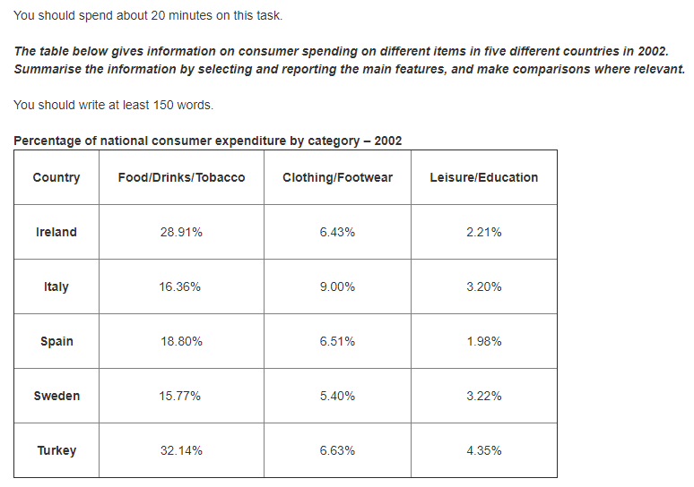
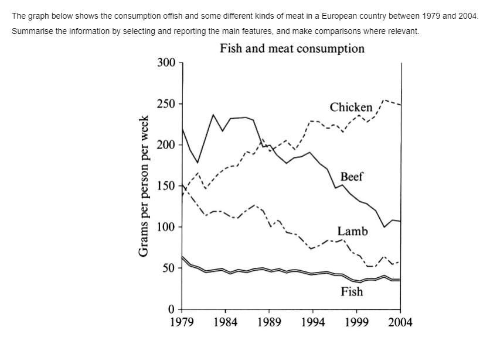
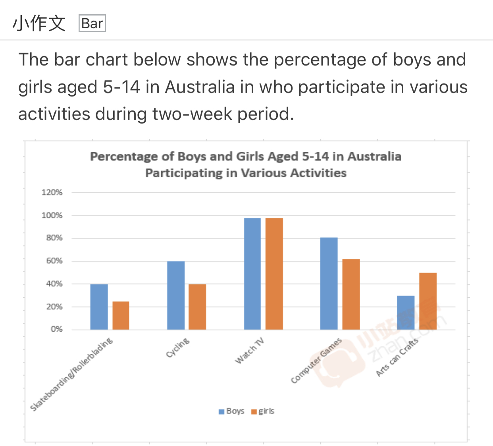
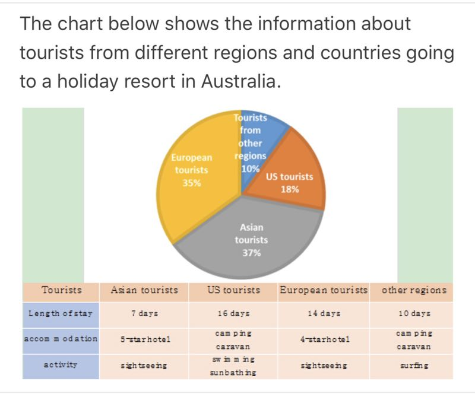
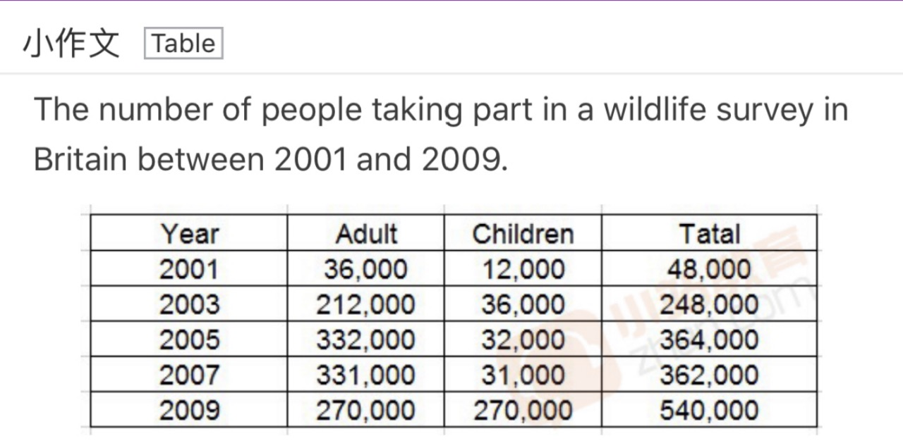
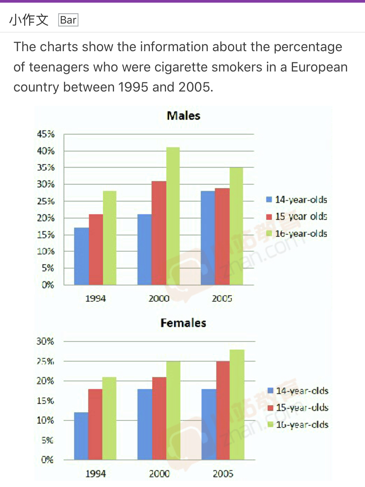
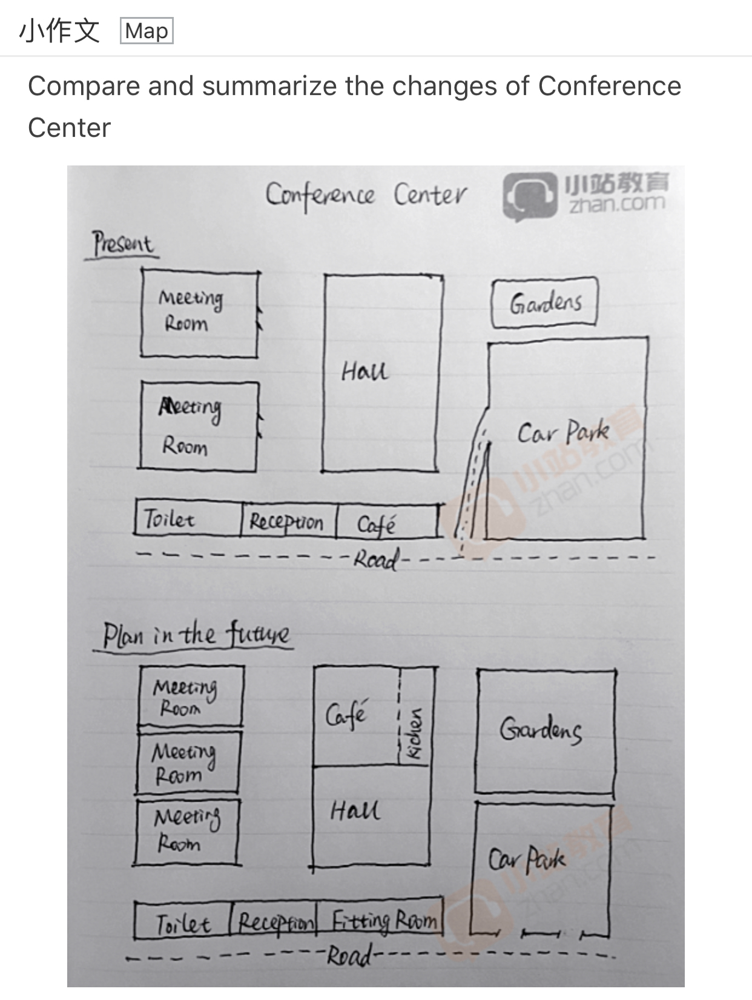

[TOC]

# Task1 练习

---

## 7-1-1

### 批改前

The table indicates how the consuption of three different items occupied in five different countries in 2002.

The percentage of the consuption of food, drinks and tobacco in Turkey was the largest, which occupied 32.14% in 2002. Similarly, the food, drinks and tobacco took up 28.91% in Ireland. While this item merely made up 15.77%, 16.36% and 18.8% in Sweden, Italy and Spain respectively in 2002.

By Contrast, the percentage of the cost of clothing and footwear was the largest in Italy, which occupied 9% in 2002. Compared with consumption of Italian, the percentage of expenditure of clothing and footwear was the smallest in Swden with 5.4%. And this item account for 6.43%, 6.51% and 6.63% in Irland, Spain and Turekey respectively. The percentage of the expenditure of leisure and education was the largest in Turkey at 4.35%. In Sweden, leisure and education occupied 3.22%. Similarly, the percentage of this item was 3.2% in Italy in 2002. Leisure and education account for 1.98% and 2.21% in Spain and Ireland.

To sum up, consumer spend more on food, drinks and tobacco in Turkey in 2002 among the five countries. In Sweden, people spend less on clothing and footwear.

### 批改后

> The table indicates how the consuption（应该是consumption） of three different items occupied in five different countries in 2002.

>The percentage of the consuption of food, drinks and tobacco in Turkey was the largest, which occupied（这里面用accounted for） 32.14% in 2002. Similarly, the food, drinks and tobacco took up 28.91% in Ireland. While this item merely made up 15.77%, 16.36% and 18.8% in Sweden, Italy and Spain respectively in 2002.（相信作者也发现，这一段里面需要反复出现foods, drinks and tobacco，十分冗杂，因此来说直接开头的时候As for food, drinks and tobacco consumption, Turkey appeared to be the largest, which … . Similarly, a 28.91% was seen in Ireland, while Sweden, Italy and Spain witnessed a 15.77% … respectively.）

>By Contrast, the percentage of the cost of clothing and footwear was the largest in Italy, which occupied（这里变换一下，… occupying 9% …） 9% in 2002. Compared with consumption of Italian, the percentage of expenditure of clothing and footwear was the smallest in Sweden with 5.4%. And（and一般不用再句子开头，这里面用Furthermore） this item account for 6.43%, 6.51% and 6.63% in Ireland, Spain and Turkey respectively. The percentage of the expenditure of leisure and education was the largest in Turkey at 4.35%. In Sweden, leisure and education occupied 3.22%. Similarly, the percentage of this item was 3.2% in Italy in 2002. Leisure and education account for 1.98% and 2.21% in Spain and Ireland.（其实这里面完全可以不用重复leisure and education，完全可以是For the expenditure in leisure and education, Turkey ranked the first with 4.35%. Second was Sweden, showing a 3.22%, which is similar to that of Italy with 3.2%. In comparison, Spain and Ireland was witnessed to have a smaller percentage, having 1.98% and 2.21% each.）

>To sum up, consumer spend more on food, drinks and tobacco in Turkey in 2002 among the five countries. In Sweden, people spend less on clothing and footwear.（结尾段毫无意义，陈述了原文中说过的东西，毫无新意，最后一段是没有意义的）

- 表现较好的方面	文章中不错的进行了论述
- 有待改善的方面	文中的句型有待提高，文中的一系列句子十分重复，结尾也毫无作用，需要一步步提升。有待提高。

### 范文

>The information given by the table is about the proportion of buyer expenditure on different items in five different nations in 2002.

>As can be seen from the table, in the five nations, most of consumer expenditure went into food, drinks and tobacco. The percentage of the item in Turkey was the highest (32.14%). It was followed by Ireland (28.91%), while that of Italy, Spain and Sweden accounted for around 16% respectively, twice as little as that of Turkey. Clothing and footwear was the second most popular spending item. In Italy, its consumers had 9% cost for the item, while that in other countries only took up less than 7%. In contrast, expenditure on leisure and education had the smallest percentage, taking up 4.35% in Turkey, about four times higher than that in Spain and doubled that in Ireland.

>Italy's consumers and Sweden's buyers alike had 3.2% cost for this item.

>In conclusion, based on what have been analyzed above, it is clear that although consumers in different country had different spending habits, food, drink and tobacco was always the most important buying item in 2002.

- 审题：
此题为表格题，是关于2002年五个国家在不同消费品上的开支。表格纵列为五个不同国家，分别是爱尔兰，意大利，西班牙，和土耳其；横列为三类不同的消费品，分别为食物/饮料/香烟，服装/鞋子，休闲/教育。数据形式为百分比。

- 写作思路：
表格题的写作思路的关键首先在于分析横、纵列，然后得出写作的顺序。分析的重点在于动态的变化和静态的比较。本题为固定时间段内的比较，不涉及动态变化。在静态比较方面，有两个思路：是每个国家在不同消费品上的开支的比较；二是不同国家在同一消费品上的开支的比较。从两个思路中的任意一个切入，都可以描述出表格的核心信息。

## 7-1-2

### 批改前
The line chart indicates how the consumption of fish and different kinds of meat changes in a European country from 1979 to 2004.

The quantity of per person consumption of beef was the largest, which was about 230 grams. However, this figure was drop from 230g to around 170g from 1979 to 1980. Although an increase can be withnessed in the amount of per person consumption of beef from 170g in 1980 to around 240g in 1984, the period of 1984 to 2004 saw a fall in this figure from 240 to about 110. Similarly, the quantity of per person consumption of lamb was the largest at 150g in 1979. On the contrary, this figure decreased from 150g in 1979 to just over 50g in 2004. As for fish consumption, this data dropped slowly from about 60g in 1979 to 40g in 2004.

By contrast, the quntity of per person consumption of Chicken was the smallest with ahout 140g in 1979. However, there was an increase in this figure from 140g in 1979 to about 250g in 2004. Specially, the consumption of chicken overtook the consumption of lamb in 1989.

### 批改后

### 范文

>The graph illustrates changes in the amounts of beef, lamb, chicken and fish consumed in a particular European country between 1979 and 2004.

>In 1979 beef was by far the most popular of these foods, with about 225 grams consumed per person per week. Lamb and chicken were eaten in similar quantities (around 150 grams), while much less fish was consumed (Just over 50 grams ).

>However, during this 25-year period the consumption of beef and lamb fell dramatically to approximately 100 grams and 55 grams respectively. The consumption of fish also declined, but much less significantly to just below 50 grams, so although it remained the least popular food, consumption levels were the most stable.

>The consumption of chicken, on the other hand, showed an upward trend, overtaking that of lamb in 1980 and that of beef in 1989. By 2004 it had soared to almost 250 grams per person per week.

>Overall, the graph shows how the consumption of chicken increased dramatically while the popularity of these other foods decreased over the period.

- 审题：
此题为曲线图，是关于1979到2004年期间某欧洲国家在鱼，羊肉，牛肉和鸡肉的消费情况。纵轴为每人每周的消费量，以克为单位。横轴为时间。

- 写作思路：
曲线图相对来说属于难度不是很大的题型。应该先根据横轴分析变化，然后再进行比较，描述变化的时候要注意归类，也就是把增长的归为一类，减少的归为另一类。同样都是增长或者减少的，则应该根据变化的幅度，从大到小排列。

## 静态图

The bar chart illustrates how the children who take part in a sort of activities during two-week period occupied in their childhood in Australia.

Watching Tv is most popular with children, which account for about 99% in Australia. And the percentage of boys and the percentage of girls are equal. This chart show that boys like sport and computer games than girls. As for Computer games, boys make up 80%, while girls take up around 61%. As for sport, the number of cycling occupy 60% and 40% in boys and girls respectively. The number of skateboarding and rollerblading make up 40% in boys and that take up 22% approximately.
Compared with computer games and sport, arts can crafts is more popular with girls than boys. The percentage of arts can crafts in girls is about 45%. By contrast, the percentage of arts can crafts in boys is around 30%.

The pie chart indicates **how the tourists' behavior from different areas occupied^1^** during a travel in Australia.

Australia tourist **~~industory~~ industry^2^** is popular with Asian and European, which tourists from Asia and Europe account for 72%. The percentage of tourists from **~~Asain~~ Asian^2^** is the largest with 37%. Asian always live in a 5-starhotel, and usually stay in Australia about 7 days. In these 7 days, their are fond of sightseeing. Compared with Asian, European usually live in a 4-starhotel rather than 5-starhotal. And the they have more time staying in Australia at 14 days. The must pupolar activity is simiar **~~with~~ to^3^** Asian, they **are^4^** both keen on sightseeing.

For US tourists, swimming and sunbathing are both popular with US tourists, and they always live in camping caravan. Specially, they could stay 16 days in Australia. But US tourists merely take up around 18%. The percent of tourist from other regions is the smallest with 10%. They live in camping caravan like US tourists during these 10 days. And their activity is surfing.

- 需要添加组之间的对比描述
1. 语法错误
2. 拼写错误
3. 一般用 be similar to ...与...相似
4. keen 是形容词，keen on 喜欢... be keen on

## 动态图

The table indicates how the number of people involved in wildlife survey activity changed from 2001 to 2009 in Britain.

The number of adult taking part in a wildlife survey were largest in 2001, which was 36,000. The quantity of children involving in this activity were 12,000. And the figure of adult is more than that of children. In 2001, there are about 48,000 taking part in a wildlife survey in Britain. The period of 2001 to 2005 witnessed a increase in number of adult involved in this activity from 36,000 to 332,000. And this figure peaked at 332,000 in 2005. Similarly, an increase can be saw in number of **children taking part in this activity^1^** 12,000 in 2001 to 36,000 in 2003. But this figure is fall back 32,000 in 2005. From 2005 to 2007, the number of adult and the number of children taking part in wildlife survey declined from 332,000 to 331,000 in adult group and from 32,000 to 31,000 in children group respectively(我想表达的是成人和儿童参加救援活动的人数分别从...增加到...). Howerver, the number of adult involved in this activity dropped from 331.000 in 2007 to 27,000 in 2009. Compared with the number of adult, the quanlity of children rocket sharply from 31,000 to 270,000. And the number of tatal in this activity increased from 48,000 in 2001 to 540,000 in 2009.

1. 没有注明儿童

1. twice 二倍
2. three times 三倍
3. larger than / smaller than / more than / less than
The adult were 200m more than the children
4. This figure sharply rise from 31,000 in 2007 to 270,000 in 2009.
    This figure sharply rise by 24,000 from 2007 to 2009.
5. there were 100 people in total 总共有100人
6. the total of people who taking part in this activity this 100.
7. 建议多写计算后的数据，比如，增加到了XXX、XX是XX的三倍、XX比XX多XXX

In 2001, the number of  people taking part in  a willife survey in total was the smallest, which was 48,000. The number of of people involved in this activity in 2003 was four times larger than those in 2001. ~~An sharp increase could be saw from  48,000 in 2001 to 248,000 in 2003.~~ The period of 2003 to 2009 saw an increase from 248,000 to 540,000 .~~And this figure peaked at 540,000  in 2009.~~

In 2001, the number of adult involved in wildlife survey was the smallest with 36,000. There was a dramatic rise in the number of adult taking part in this activity from 36,000 in 2001 to 212,000 in 2003. This figure slowly incline from 212,000 in 2003 to 332,000 in 2005. However, there was a drop in this figure from 332,000 in 2005 to 270,000 in 2009.

In 2001, the number of children taking part in wildlife survey was the smallest at 12,000.  This figure in 2003 was three times larger than those in 2001. But a drop could be seen from 36,000 in 2003 to 31,000 in 2007.  This figure sharply rise from 31,000 in 2007 to 270,000 in 2009.

The charts indicate how the percentage of teenagers who were cigarette smokers changes in a European country from 1995 to 2005.

In 1994, the percentage of males smoker in their 14s was the smallest, which was about 16%. This figure sharply raised by 10% from 1994 to 2005. Similarly, the percentage of males smoker in their 15-year-old increased from about 21% in 1994 to 27% approximately in 2005. For male smoker in their 16-year-old, this figure was the biggest among the three group in this decade. In 1995, this figure was the largest  with 27%. There was a dramatic rise in the percentage of males smoker in their 16s from 27% in 1994 to 35% in 2005. And the percentage of males smoker in their 16s took up 7% more than both those in their 14s and 15s.（想表达：在青少年16岁时抽烟的占比是在这些人在他们14和15岁时多了7%）

In 1994, the percentage of females smoker in their 14s was the smallest at about 12%. An increase could saw in this figure from 12% in 1994 to 16% in 2005. In 1994, females smokers in their 15s occupied about 16%. And after 10 year later（十年以后不知道有没有好的表达）, this figure increased from 16% in 1994 to 25% in 2005. Meanwhile, for females smoker in their 16-yeas-old, there was a rise in this figure from 21% in 1994 to 26% in 2005. And the figure in 1994 was twice larger than smoker in their 14s in 1994.

## 地图题

---

