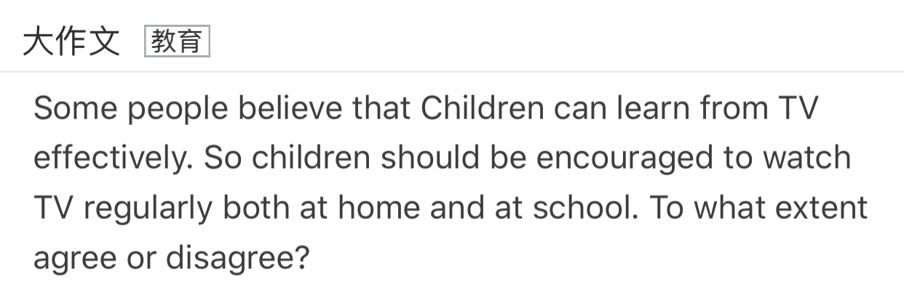
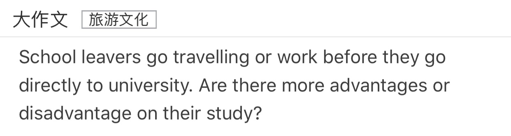
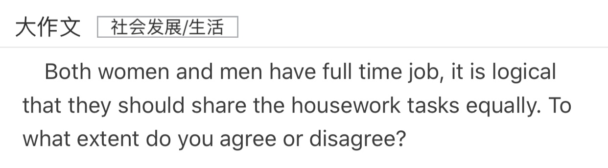
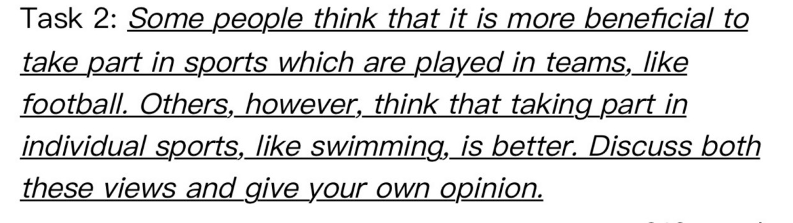

[TOC]

# Task2 练习

---

## 7-1-1

### 批改前

分论点1：
人们努力锻炼
通过后天的学习和训练-熟练掌握-在某一领域获得良好的成绩-变成优秀的运动员或者音乐家
通过
分论点2：
虽然天赋在某些领域可能起到重要作用，但是后天的努力可以弥补

Nowadays, many people aruge that some people are born with certain talents, such as sport, music. However, other think that any child can be taught to become a outstanding sprots person or musican. In my opinion, I think everyone can become good sprots person or musician by receiving education.

In my opinion, everyone can become outstanding 

### 范文

>The relative importance of natural talent and training is a frequent topic of discussion when people try to explain different levels of ability in, for example, sport, art or music.

>Obviously, education systems are based on the belief that all children can effectively be taught to acquire different skills, including those associated with sport, art or music. So from our own school experience, we can find plenty of evidence to support the view that a child can acquire these skills with continued teaching and guided practice.

>However, some people believe that innate talent is what differentiates a person who has been trained to play a sport or an instrument, from those who become good players. In other words, there is more to the skill than a learned technique, and this extra talent cannot be taught, no matter how good the teacher or how frequently a child practices.

>I personally think that some people do have talents that are probably inherited via their genes. Such talents can give individuals a facility for certain skills that allow them to excel, while more hard-working students never manage to reach a comparable level. But, as with all questions of nature versus nurture, they are not mutually exclusive. Good musicians or artists and exceptional sports stars have probably succeeded because of both good training and natural talent. Without the natural talent, continuous training would be neither attractive nor productive, and without the training, the child would not learn how to exploit and develop their talent.

>In conclusion, I agree that any child can be taught particular skills, but to be really good in areas such as music, art or sport, then some natural talent is required.

- 审题：
普遍认为一些人生来就有某方面的天分，比如在体育或是音乐方面；而另一些人没有。

- 写作思路：
本文需要讨论要成为出色的运动员或是音乐家，是天分依靠，还是靠后天的教育和训练才能做到。构思时，考生应该从两方面进行分析和论证，在此基础上得出自己的倾向。最简单的写法是文章分为四段：第一段引出话题，第二、三段分别讨论两个方面的观点和各自的理由，第四段提出自己的观点。更加复杂一点的写法是把自己的观点结合进第二、三段，也就是说，在讨论别人观点的时候就进行有倾向性的评价。    

## 7-1-2

### 批改前

观点：应该对不同类型的罪犯施行不同的刑罚
分论点1：
可以对罪犯进行合适的改造
对不同罪犯进行不同的刑罚-

分论点2：

Nowadays, many people argue that different kind of crime should be fixed punishments. However, others think that people should 

## Education

### 批改后

Wathing Tv could helps children broadern horizon, gain knowledge, and get hold of the social develompent. There are a kind of programmes in a verity of channels. For example, chhildren can have access to documentary about universe, countries and animals, which children can not  learn from lessons at school.

Tv programme could helps children improve memory effect and develop their perception ability. There are many vivid images and sound effects, which can attract children's attention. As a result,  it is easy for them to remember what they are wachting.

It is admitted that waching Tv can bring many problmes. For example, wathing Tv too much has bad effects on eyes. Besides, there are many pool quality-programmes, which can affect the mental develpment of  young people.

* 英文逗号可以连接单词、动作、句子
* gain/acquire/attain 获得
* can have access to 可以获得
* It is easy to do. 做sth很容易
* help sb do / to do 帮sb做sth

## Government and Society 

There are many advantages for younger people to take on government positions. To begin with, young man are usually more energietic and createtive than elder, which means younger people have more passion for their career. As a result, government operation efficiency could be improved. In addition, younger people are good at study and more enjoy leaning especially new thing, which lead to the fact that reform could be fast and smooth.

## Tourism

1. 可以提升学生的能力
    - 学生在旅行和工作的过程中接触到社会各个层面的人（比如老板、警察、有过求助经历的陌生人）和独立处理旅行中的问题->学生可以在这个过程中提升独立能力->为大学的独立生活做准备
2. 学生们可以经历不同的文化
    - 通过旅行学生可以经历不同的文化（比如饮食、风俗、当地语言）->开阔视野->可以学到学校中无法教授的经历
3. 旅游可以减轻学生的压力
    - 旅行可以到处游玩->游玩的过程使学生的精神放松下来->有利于身体和精神的健康->学习会有更好的表现

Many school leavers select travelling or working rather than go to university. In my view, **~~I think~~^1^** experiencing a gap year before they go to college has more advantages on their study.

Gap year is good at development of student's ability. In travelling and working, students could address a kind of problems without parents' help. Meanwhile, students could associate with a **~~varity~~ variety^2^** of people such as their boss, officers, and strangers who have provided assistance, which lead to the fact that personal ability of student could be developed significantly. As the result, 

Experience is a quite important part of personality. People could be **~~involve~~ involved^3^** a **~~varity~~ variety^2^** of culture such as diet, local custom, and local language, which help student **~~broadern~~ broaden^2^** horizon, gain knowledge, and get hold of the social **~~develmopent~~ development^2^**. And these are not **~~tuaght taught~~^2^** in campus.

In travelling, students' stress can be released effectively. People's mood can relax in some extent, due to travelling **~~aroud~~ around^2^** the world. It is beneficial for mental and physical health. And Then, students will have a better performance in **~~thire~~ their^2^** further studies in university.

To sum up, there are many advantages **~~when~~ for^4^** students travelling or working instead of going to university directly.

1. In my View / I think 两者选其一
2. 拼写错误
3. 此处involved用被动，表明人们参加，能够接触到文化的意思。如果用主动是指人们涉及到一系列的文化
4. 介词使用错误。对于学生来说旅行的好处，而不是当学生们旅行时的好处

## Gender 

Recently, An increaseing number of women have full time jobs, which means that  they would have less time to do  household chores. So, many people suggest that both women and men should share the housework task equally. As far as  I am concerned, I disagree this statement.

The volume of housework denpends on familiy member's contribution to their families. To be specific, people who have less contribution especially aspect of economic should shoulder/undertake more household choress. For example, people who contributes more to their family could spend more time in getting more money rather than  doing housework at which they are not good.

Household chores should be divided accoding to  people's work time. Some work longer while others have flexible work time, which means that it is impossible to  divide their housework time equally . There are two different reasons. Firstly, people who spend more time in their jobs such as woker in factory always have less time in their house, so, they could not undertake more hoursehold choress. Secondly, what many people are good at is different. To be specific, most men suitable for heavy work and women are good at housework that needs care and patience.
## Sport and Leisure

- 双边讨论话题
- 团队运动
    - 培养团队合作精神
    - 提升个人沟通能力
    - 队长可以提升自身的领导能力
    - 队员之间可以促进友情
    - 
- 个人运动 
    - 不用顾及人数的限制，可以随时进行运动
    - 提高自己解决问题的能力

Recently, more and more people enjoy a variety of sport, such as football, swimming and so on. Many people think that taking part in team sports is more beneficial. But others think it is beneficial to take part in individual sports. In the writing below, both views will be discussed and my opinion will be given.

**~~Many people think that~~^1^** Team sports is better than individual sports. Firstly, teamwork is quite important to many sports, such as football, basketball, volleyball and so on, which needs perfect collaboration between team. So, during the sport or match period, these sports not only needs teamwork but also could improve team spirit for every team members. Secondly, it is useful that improve people's communication skills. In a kind of team sports with others, a man must communicate with other members. And communication is vital to a sport especially a match. Every team member **~~have~~ has^2^** chance to communicate with each other, which could improve member's communication skills. In addition, both improving captain's leadership and developing team member's friendship could advance in sports which are played in teams.

**~~However, others think~~^1^** Individual sports is more beneficial. Individual sports **~~are no~~ do not^6^** number limit such as swimming and walking. So people could sport everytime without other team member. Besides, individual sports could improve our ability of solving problems. For example, people are usually **involved in^7^** a variety of problems such as injuries. **~~So, we must solve these problems alone.~~**

In my view, team sports is better than individual sports.

1. 
2. 注意单三
3. 
4. 
5. 
6. 没有人数限制 do not have number limit
7. involved in 参与到
8. 独立解决问题的例子不合适