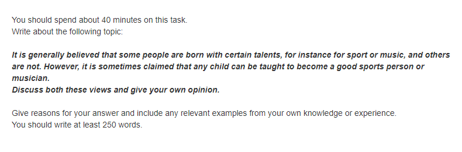
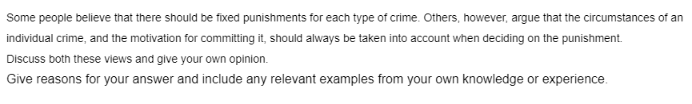

[TOC]

# Task2 练习

---

## 7-1-1

### 批改前

分论点1：
人们努力锻炼
通过后天的学习和训练-熟练掌握-在某一领域获得良好的成绩-变成优秀的运动员或者音乐家
通过
分论点2：
虽然天赋在某些领域可能起到重要作用，但是后天的努力可以弥补

Nowadays, many people aruge that some people are born with certain talents, such as sport, music. However, other think that any child can be taught to become a outstanding sprots person or musican. In my opinion, I think everyone can become good sprots person or musician by receiving education.

In my opinion, everyone can become outstanding 

### 范文

>The relative importance of natural talent and training is a frequent topic of discussion when people try to explain different levels of ability in, for example, sport, art or music.

>Obviously, education systems are based on the belief that all children can effectively be taught to acquire different skills, including those associated with sport, art or music. So from our own school experience, we can find plenty of evidence to support the view that a child can acquire these skills with continued teaching and guided practice.

>However, some people believe that innate talent is what differentiates a person who has been trained to play a sport or an instrument, from those who become good players. In other words, there is more to the skill than a learned technique, and this extra talent cannot be taught, no matter how good the teacher or how frequently a child practices.

>I personally think that some people do have talents that are probably inherited via their genes. Such talents can give individuals a facility for certain skills that allow them to excel, while more hard-working students never manage to reach a comparable level. But, as with all questions of nature versus nurture, they are not mutually exclusive. Good musicians or artists and exceptional sports stars have probably succeeded because of both good training and natural talent. Without the natural talent, continuous training would be neither attractive nor productive, and without the training, the child would not learn how to exploit and develop their talent.

>In conclusion, I agree that any child can be taught particular skills, but to be really good in areas such as music, art or sport, then some natural talent is required.

- 审题：
普遍认为一些人生来就有某方面的天分，比如在体育或是音乐方面；而另一些人没有。

- 写作思路：
本文需要讨论要成为出色的运动员或是音乐家，是天分依靠，还是靠后天的教育和训练才能做到。构思时，考生应该从两方面进行分析和论证，在此基础上得出自己的倾向。最简单的写法是文章分为四段：第一段引出话题，第二、三段分别讨论两个方面的观点和各自的理由，第四段提出自己的观点。更加复杂一点的写法是把自己的观点结合进第二、三段，也就是说，在讨论别人观点的时候就进行有倾向性的评价。    

## 7-1-2

### 批改前

观点：应该对不同类型的罪犯施行不同的刑罚
分论点1：
可以对罪犯进行合适的改造
对不同罪犯进行不同的刑罚-

分论点2：

Nowadays, many people argue that different kind of crime should be fixed punishments. However, others think that people should 

## 作业1

### 批改前

