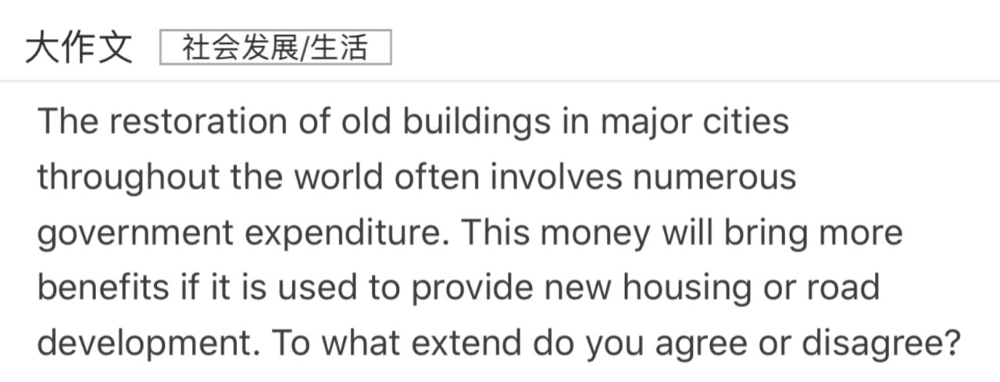
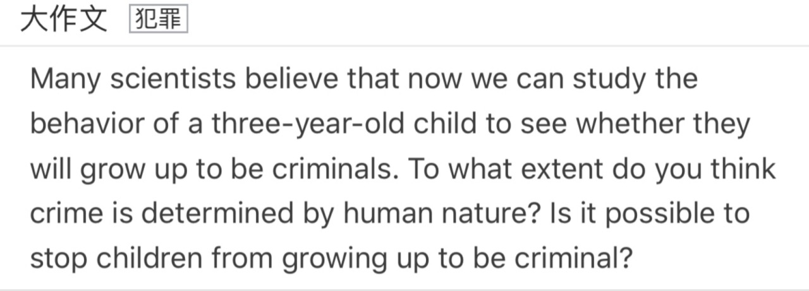
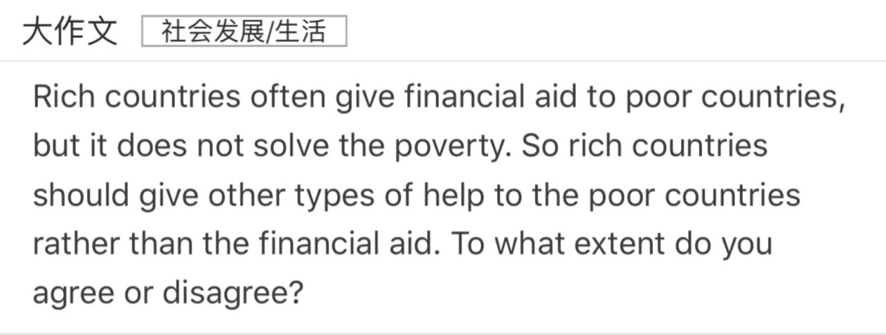
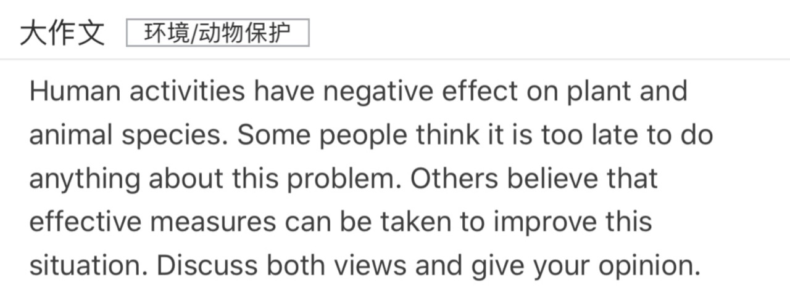

[TOC]

# Task2 练习

---

## Education

### 1.

Wathing Tv could helps children broadern horizon, gain knowledge, and get hold of the social develompent. There are a kind of programmes in a verity of channels. For example, chhildren can have access to documentary about universe, countries and animals, which children can not  learn from lessons at school.

Tv programme could helps children improve memory effect and develop their perception ability. There are many vivid images and sound effects, which can attract children's attention. As a result,  it is easy for them to remember what they are wachting.

It is admitted that waching Tv can bring many problmes. For example, wathing Tv too much has bad effects on eyes. Besides, there are many pool quality-programmes, which can affect the mental develpment of  young people.

* 英文逗号可以连接单词、动作、句子
* gain/acquire/attain 获得
* can have access to 可以获得
* It is easy to do. 做sth很容易
* help sb do / to do 帮sb做sth

### 2. 

Some people think that art classes should not be a compulsory classes at high school such as painting and drawing, because these subjects are not important compared with other classes. I disagree with this statement.

Art classes is quite important a part of rounded education, and is significant for the rounded development of children as well. Art education could inspire students' creativity and improve their ability of artistic appreciation, which is very useful for their life in the future. As the result, art classes should be required classes in senior education.

Some children in their high school are interested in art, **and <u>plan to</u> devote to art career.^1^** Some children's talent **could ~~be~~ emerge^2^** such as painting, drawing and music, and they want to be a artists in the future. So, school should encourage them to study knowledge about arts instead of other subjects.  For these students, **art classes are ~~more important than~~ other classes,^3^** so art classes should be a compulsory subject at high school.

Art could recover students' mental state when they are very tired because of learning other classes. Recovering mental state is fairly significant for learning different **~~type~~ classes^4^**. For example, **~~people are easy tired to study same subjuct or doing same works for long time,~~^5^** which lead to reduction of efficiency. Appreciating art could relieve tiredness.

To sum up, art classes plays an important role in both personal rounded development and the career prospect of future.

1. 改为and plan to devote to art career. 因为现在学生还没有献身于艺术事业，只是计划。或者是改为将来时and will devote to art career.
2. 学生的天分显露出来，而不是被显露出来
3. 应改为art classes are as important as other classes. 表示与其他科目一样重要。因为题目中论述的是are not as important as other subjects. 没说那个科目更重要。
4. type 是名词，应改为type of classes
5. and or前后词性应该一致,people are easy tired of studying same subject or doing same works for long time, 

## Government and Society 

There are many advantages for younger people to take on government positions. To begin with, young man are usually more energietic and createtive than elder, which means younger people have more passion for their career. As a result, government operation efficiency could be improved. In addition, younger people are good at study and more enjoy leaning especially new thing, which lead to the fact that reform could be fast and smooth.

### 1.

Recently, more and more people select driving car when they commute and travel. However, unlimited use of cars could cause many problems. The reason of problems will be discussed. And I agree with this measure.

**There are mainly two problmes that caused by use of cars^1^.** Firstly, the most important problem is traffic jam. The roads might be more crowed due to more people driving on the road, which lead to the fact that people must spend more time on commute and travel. Secondly, environment pollution is a problem as well. The car could emit fumes, which lead to the fact that air might be pollute and the quantity of CO2 might be increase. As the result, it has a bad effect on environment. 

Government could discourage people to use car as the way to reduce the problems. To begin with, government could develp public transport such as bus, subway and shared bicycle. People to commute by bus or subway could reduce congestion. Secondly, scientists and engineers could devlelping clean energy to reduce air pollution such as solar energy and wind power. Reducing use of fuel could relieve effect of environment pollution. 

To sum up, discouraging people to use car could sovle a variety of problems.

1. be caused by, There are mainly two problmes that are caused by use of cars

### 2.

Recently, there is a heat topic about whether children have much freedom. Some people think that children have much freedom, while others think that children have litte freedom. **~~In my View,~~^1^** I agree with the second one.

In the attribution of free time, children are not able to **decide^2^ how to use it.** Nowadays, children have more and more free time because of **rounded education^3^**. So many children prefer to do exercise or play games such as playing football, playing electronic games. However, their parents arrage some activities for them such as learning English and math. As the result, most of their spare time spend in a kind of training course.

For the selection of university, parents always decide to select their major instead of children. Because parents think that some major have career prospect, and children will have a good occupation in the future. Although, children prefer to select their major depend with their interest. So, children cannot decide freely their life.

**It is admitted that some minor things can be decided by children.^4^** For example, children could decide how to use their pocket money. Most of parents give money to their children weekly and hope children spend pocket money on lunch and learning. But many children might spend money on refreshment and playing games.

To sum up. Children have freedom in some minor things while they are always unable to make determination in **decisive^5^** things.

1. 不要重复
2. decide是及物动词，后面加名词或者从句
3. rounded education 素质教育 
4. 让步，最后一段如果没有论证，可以用让步，但是反方观点一定要比正方弱
5. decisive 决定性的

### 3.

Nowadays, **<u>with the development of high technology, all kind ofcoomunication tools emerge</u>^1^ ~~more and more people~~ an increasing of people^2^** are using phones and computers instead of **~~face to face to communicate~~ face-to-face communication^3^**. So, some people think that this phenomenon **could <u>lead to the fact that people</u>^4^** lose the ability of communication with other people face to face. I agree with this statement.

Long time using electronic device might bring some bad effects on ability of communication. It need **~~take more time on people to interactive~~^5^ take more time for people to interact**. People communicating online with each other usually have to spend more time in thinking than face-to-face communicating, which leads to the fact that people need more time to prepare their constracture of statement and valcabulary. As the result, their behavir might not be fluquency. Obviously, **~~these people's ability of communication is lost.~~ these people may lose ability of communication^6^**

People using emoji might **~~weak~~ weaken^7^** people's expression of mood, which could bring bad effect on communication ability. Emoji is quite popular on Internet. People always use emoji to express their ideas and mood rather than using verbal. As a result, **~~people could not be better to express their mood on their face.~~ people could not express their mood on their face better.~~^8^**

**It is admitted that^9^** some people **occasionally meet^10^** each othor in some place such as cafe and resturant. And they might have short-time communication. But they still use phones rather than communicating with each other face to face.

1. 如果字数不够可以添加背景句
2. 越来越多的人，more and more people = an increasing number of people
3. face to face adj. face-to-face adv
4. 不能是原句phenomenon could lose the ability.的这个现象可以丧失能力，而是这个现象导致的fact是人们丧失能力，丧失能力的是人们而不是现象。
5. it take ... on... 在...花费...; it take ... to ... 对于...花费了
6. 能力不能被动丢掉，而是失去，失去用主动语态
7. weak adj; weaken v 弱化
8. 将...做的更好，better放在句子后面
9. It is admitted that 写让步使用
10. occasionally 偶尔，occasionally meet 偶尔见面

### 4. 

The government expenditure might be **~~occpied by~~ <u>distributed to</u>^1^** repairing old building in major city in some countries. Some people think that **~~that this money is used to~~ <u>spending this money on</u>^2^** contruction of new building or road is more beneficial. I agree with this statement **<u>because of several reasons</u>^3^**.

Building new house might promote the development of economy. **<u>To be specific,</u>^4^** construction of building always needs numerous workforce **~~and a variety of materials such as steel and concrete~~^5^**, which means that market could provide more job opptunities such as engineers and ordinary works. And these workers might involve in the construction of building and production of building material. So, it will **~~drop~~ <u>reduce</u>^6^** the rate of unemployment .Meanwhile, government needs to buy building material such as steel and concrete from domestic company, which leads to the development of GDP. As a result, the revenue of country will increase.

To invest building of road could solve the problems of traffic in major city. An increasing number of cars in major cities and crowed road might lead to jam, which means that people have to **spend more time in commuting.^7^** So, people might feel anxious and tired. As a result, people might have a sence of unhappiness. So, countries should use money to construction of road instead of restoration of old building.

It is admitted that some old buildings have numerous historical value. So, government need to protect these buildings as tourist attraction and these historical buildings could attract more visitors. As a result, tourist industry could develop.

1. 用词不当
2. 一般不用 that that 宾语从句中套用主语从句，可改为动词不定式
3. 用于主体段原因的展开
4. 具体地说
5. 第一点是增加劳动力的需求->降低失业率，第二点是通过购买国内的建筑材料->提升GDP
6. drop 是不及物动词
7. spend ... in doing sth. spend ... on sth.

## Tourism

### 1.

1. 可以提升学生的能力
    - 学生在旅行和工作的过程中接触到社会各个层面的人（比如老板、警察、有过求助经历的陌生人）和独立处理旅行中的问题->学生可以在这个过程中提升独立能力->为大学的独立生活做准备
2. 学生们可以经历不同的文化
    - 通过旅行学生可以经历不同的文化（比如饮食、风俗、当地语言）->开阔视野->可以学到学校中无法教授的经历
3. 旅游可以减轻学生的压力
    - 旅行可以到处游玩->游玩的过程使学生的精神放松下来->有利于身体和精神的健康->学习会有更好的表现

Many school leavers select travelling or working rather than go to university. In my view, **~~I think~~^1^** experiencing a gap year before they go to college has more advantages on their study.

Gap year is good at development of student's ability. In travelling and working, students could address a kind of problems without parents' help. Meanwhile, students could associate with a **~~varity~~ variety^2^** of people such as their boss, officers, and strangers who have provided assistance, which lead to the fact that personal ability of student could be developed significantly. As the result, 

Experience is a quite important part of personality. People could be **~~involve~~ involved^3^** a **~~varity~~ variety^2^** of culture such as diet, local custom, and local language, which help student **~~broadern~~ broaden^2^** horizon, gain knowledge, and get hold of the social **~~develmopent~~ development^2^**. And these are not **~~tuaght taught~~^2^** in campus.

In travelling, students' stress can be released effectively. People's mood can relax in some extent, due to travelling **~~aroud~~ around^2^** the world. It is beneficial for mental and physical health. And Then, students will have a better performance in **~~thire~~ their^2^** further studies in university.

To sum up, there are many advantages **~~when~~ for^4^** students travelling or working instead of going to university directly.

1. In my View / I think 两者选其一
2. 拼写错误
3. 此处involved用被动，表明人们参加，能够接触到文化的意思。如果用主动是指人们涉及到一系列的文化
4. 介词使用错误。对于学生来说旅行的好处，而不是当学生们旅行时的好处

## Gender 

### 1.

Recently, An increaseing number of women have full time jobs, which means that  they would have less time to do  household chores. So, many people suggest that both women and men should share the housework task equally. As far as  I am concerned, I disagree this statement.

The volume of housework denpends on familiy member's contribution to their families. To be specific, people who have less contribution especially aspect of economic should shoulder/undertake more household choress. For example, people who contributes more to their family could spend more time in getting more money rather than  doing housework at which they are not good.

Household chores should be divided accoding to  people's work time. Some work longer while others have flexible work time, which means that it is impossible to  divide their housework time equally . There are two different reasons. Firstly, people who spend more time in their jobs such as woker in factory always have less time in their house, so, they could not undertake more hoursehold choress. Secondly, what many people are good at is different. To be specific, most men suitable for heavy work and women are good at housework that needs care and patience.

## Sport and Leisure

### 1.

- 双边讨论话题
- 团队运动
    - 培养团队合作精神
    - 提升个人沟通能力
    - 队长可以提升自身的领导能力
    - 队员之间可以促进友情
    - 
- 个人运动 
    - 不用顾及人数的限制，可以随时进行运动
    - 提高自己解决问题的能力，在以后的生活中会

Recently, more and more people enjoy a variety of sport, such as football, swimming and so on. Many people think that taking part in team sports is more beneficial. But others think it is beneficial to take part in individual sports. In the writing below, both views will be discussed and my opinion will be given.

**~~Many people think that~~^1^** Team sports is better than individual sports. Firstly, **teamwork is quite important to many sports, such as football, basketball, volleyball and so on, which needs perfect collaboration between team.^3^** So, during the sport or match period, these sports not only needs teamwork but also could improve team spirit for every team members. Secondly, it is useful that improve people's communication skills. In a kind of team sports with others, a man must communicate with other members. And communication is vital to a sport especially a match. Every team member **~~have~~ has^2^** chance to communicate with each other, which could improve member's communication skills. **In addition, both improving captain's leadership and developing team member's friendship could advance in sports which are played in teams.^5^**

**~~However, others think~~^1^** Individual sports is more beneficial. Individual sports **~~are no~~ do not^6^** number limit such as swimming and walking. So people could sport everytime without other team member. Besides, individual sports could improve our ability of solving problems. For example, people are usually **involved in^7^** a variety of problems such as injuries. **~~So, we must solve these problems alone.^8^~~**

**In my view, team sports is better than individual sports.^9^**

1. 不需要其他人认为，直接论述
2. 注意单三
3. 拓展团队合作的优势，要延伸到以后的工作和学习中
4. 
5. 应该放在结尾段进行说明
6. 没有人数限制 do not have number limit
7. involved in 参与到
8. 独立解决问题的例子不合适
9. 后面需要再讲理由，结尾段不能一句话。写一个我自己支持的原因

### 2.

- 原因
    - 人口急剧增加
    - 人们对食物的要求变高，比如，质量，营养，多样化
- 措施
    - 发展科技，在少的土地上高产，比如，立体农业
    - 保护土地，环境保护

Recently, the sort of food is more rich in our society. People' demand for food is increasing in the world. The reason of increase will be discussed and measures will be given.

There are two factors for the rise in the need food. Firslty, the world population sharply rocket in recent years, which was about 6 billion. More people means more food everyday. Scondly, with the repaid development of technology and economy, people's living  standard is improve greatly. That is say, many people need higher quantily and a wide of food. For example,  people used to have one or two kind of food, but now they can afford more food in one dish so that there much more nutrition in the diet. As a reslut, they have healther body.

Two measures can be taken to sovle this problems. To begin with, Scientists and experts in argiculture develop technology about productive and  higher quanlity 

## Money

### 1.

- 增加额外的财富，建设更多的文化娱乐设施，丰富人们的生活，人们会更加幸福
- 增加额外的财富，使得社会的各个方面更加完善，人们安居乐业，人们会更加幸福
有更多的钱-发展工业经济-生产大量的产品-降低产品价格-物质丰富
- 有更多的钱，人们可以享受更多的物质生活和满足精神生活的需要

Recent years, many people suggest that additional economic wealth cannot makes residents happier when a country is already rich. In my view, I disagree with this statement.

The quality construction of infrastructure could makes people happier, which might need more money. Due to construction of city facilites such as market, station and airport, people's  life **might be^1^** more convenient and comfortable. So people who lives there will be more happy. As a result, for a country, making people happier usually need more economic wealth, though the country is already rich now.

**To meet people's high level physical life and mental life usually need more money to support. ^2^**

Rich material life could make people **more happy^3^**. With the economy developing rapidly, the government could earn more money,  which lead to the fact that authority could develop local industry such as chemical factories and so on. As the result, the price of production might lower and the quality of production might higher. People could enjoy high quality production and life level. Therefore, people could **more happy^3^**.

1. more 是系动词，might 后要加 be，might be more convenient
2. 新增观点。To meet people's high-level life and high-quality education usually need more money to support. Government should invest in education and public health area such as constructing more schools and hospitals, which lead to the fact that the quality of education and medicine in that district might be improved. As the result, people who live in the area will happier. 
3. happy是个形容词，比较级是happier，前面应该有be动词

## Crime

### 1.

In some area of the world, an increasing number of crimes are being committed by teenagers and children. The reason of increase will be discussed and measures will be given.

The lack of family education is a most important reason. Firstly, some parent spend more time on their work or career rather than accompanying their children. So, this teenagers are short of parental care, which lead to the fact that children could **~~have a sence of lonely.~~ <u>feel lonely</u>** And this phenomenon could bring bad effect on children's development of character. As the result, some children could produce misconduct. Secondly, some parents might neglect their children's bad behavior such as associating with friends who have bad behavior, dropping out of school, drinking and smoking. A large number of parents usually do not attach importance to this behavior, which lead to the fact that some children might develop into a crime.

What unhealthy media said could bring bad effect on children and teenagers. Media such as TV, Internet, and books could spread harmful information such as violence, which could bring bad effect on children. So, some children might **~~produce misconduct~~ behave badly^2^** under the bad influence. More importantly, some children might grow in this surrounding all the time and **~~through learning bad content from unhealthy media, children could involve some crimes.~~**

Two meansures can be taken to solve this problem. Firstly, parents should create a balance between achieving career goals and accompanying their children. Accompanying their children go through some vital points of children's growth, and give some advice about how to deal with the relationship between friends and classmates. Secondly, goveronment should forbid the spread of harmful information, and take care about children who drop out from school.

1. lonely是形容词，不能与sence of + n使用。loneliness是名词，可以sence of loneliness，可以用feel lonely 感到孤独
2. 坏的行为
3. through ... , sb could ...

### 2.

Recently, with the development of science, many scientists think that people could predict that some children may grow up to be criminals in the future by studying the behavior of these children in their **three years old^1^**. In my view, the crime is not determined by human nature. And it is possible that people prevent children from growing up to be criminal by carrying out some measures such as mental education.

The lack of family education is most important reason which children grow up to be criminal in the future. Because some parents spend more time on their career or work, they always have not enough time to accompany their children, and these parents might not teach their children what is right and wrong, which means that their children might behave badly **such as fight and steal ^2^** under the bad influence via making friends who have bad behavior. As a result, these children might grow up to be criminal. 

What unhealthy media said could bring bad effect on children. Some unhealthy media **program via TV and Internet might spreed harmful information that bring bad effect on children,^3^**  which lead to the fact that some children might learn bad behavior such as abuse and fight. So, some children might grow up to be criminal, though they are considered a good people in their **three years old^1^**.

Two measures can be taken to prevent children growing up to be a criminal. Firstly, parents create a balance between achieving their career goals and accompanying their children. And parents should spend more time on accompanying their children. Secondly, the government should forbid the spread of harmful information, and take care about children who drop out the school.

1. 
    - three years old 用法：Her son is three years old，When I was eight years old, my sister was three years old.
    - three-year-old 用法：The 74-year-old mayor is credited...
2. 缺少父母陪伴->父母没有告诉他们什么是对和错->会跟着有坏习惯比如打架和盗窃的人学坏->进一步导致犯罪
3. 不健康的媒体节目通过电视或者网络传播有害信息->导致一些孩子学坏行为例如打架->孩子可能会发展成为犯罪

## Work

### 1. 

Recently, with the development of technology and sicence, an increasing number of machines complete the hard physical work in certain industry. In my view, this trend has more positive effects than negative effects.

The machine could be good at involving hard physical works better. The power of machine is bigger than that of human. So, machine is more fit hard physical works which always harm **~~personal~~ individual health^1^** such as moving heavy stuff, working for long time and working in a noisy environment. Besides, people usually generate bad mood such as a sense of bore, because of a large quantity of repetitive works. As a result, this bad mood could bring bad influence such as decline of work efficiency, which is disadvantage for economic development.

Some industry might benefit from using machine instead of human. For example, employer must pay salary and insurance for their employee, which is a large part of expenditure. Compared with human, machine just need power such as fossil fuel and electric power. That expenditure is far lower than cost of labor. As a result, some factory might gain economic profit from using machine.

It is admitted that the overuse of machine could bring some society problems. For example, an increasing number of machines might occupy more human's jobs, which lead to the increase of unemployment rate.

To sum up, although the overuse machine could bring some society prbolems, machine generate a large amount of benefit to society.

1. personal 个人的，私人的。individual health 个人健康

## Global issues

### 1. 

Recently, with the development of society, the gap between countries are more narrow. **~~People could enjoy same films, brands, fashion, advertisements and TV channels.~~ <u>Same things might happen in different countries simultaneously</u>^1^** In my view, this phenomenon has more advantages.

**~~It is the important for broaden^2^ people's horizon that people could share their entertainment such as filems, fashion and TV channels.~~ <u>That people share their entertainment such as films, fashion and TV channels is important for broadening people's horizon.</u>^2^** People especially children could gain more **knowledge^4^** about the other customs in the world, which leads to the fact that people could **eliminate ~~mistakes~~ <u>misunderstanding</u>^5^** between different nations. As a result, people coulde reduce conflict because of **~~mistakes~~ <u>misunderstanding</u>^5^** of customs **~~in some extent~~<u>to some extent</u>^6^**. So, the world might be more peaceful and people might be happier.

Promoting communication between different countries could **benefit^7^** the world. Communication between different countries could be beneficial for some industries such as tourism and international trade. People could learn about other countries' products through advertisements and TV channels, which **~~leads the fact that~~^8^** the economy could improve in the world. For example, **for developing countries, people could buy some natural products such as fruits and sea-food.^9^** Meanwhile, people could travel in developed countries **~~as well~~<u>and</u>^10^** buy high-tech products in USA and enjoy fashion show in France. **~~So, it has benefit to development of economics in whole of the world.~~<u>Sale of products might increase. As a result, economy in these coutries develop faster. So, it is beneficial for the development of global economy</u>^11^**

It is admitted that globalization could bring some problems. **~~For example, some people and media spread harmful information through network and TV channels. As a reasult, some children could suffer bad effect.~~<u>For example, some people could celebrite westen festival such as christmas. As a result, tranditional festival in certain countries lose popularity.</u>^12^**

To sum up, although globalization might bring some problems, promoting communication between different countries could benefit for the world.

- 注意：表目的用to，表对...来说用for
- as...as
    - as soon as possible 尽可能快 adv.（固定用法）（as adv. as）
        - I will finish my work as soon as possible. 我尽可能快的完成我的工作
    - as soon as 表一...就...
        - As soon as I finish my work, I will play game. = I will play game as soon as I finish my work. 我一工作完就玩游戏
    - as adv as 像...一样
        - as far as: I can run as far as you can. 我能跑的跟你一样远
        - as beautiful as

1. 与题目中句子重复，建议改变说法
2. broad 宽的 adj. broaden-broadened-broadened-broadening 扩大
3. 语法错误，主语从句举例：That I like you is true.(从句不缺成份);What I want to say is that... .(从句缺成分，成分是what)
4. 注意发音knowledge
5. mistake 错误，misunderstanding 误解，辨析
6. to some extent 在一定程度上
7. 关于benefit的用法。
    - 作名词，Climbing has 3 benefits for body.
    - 做动词，Climbing benefits our body.
    - 做形容词，Climbing is beneficial for our body.
8. which leads the fact that = which means that
9. 举得例子不太好，可以详细举例。For example, American could buy some natural products such as dairy from Austrilia. Meanwhile Japanese could travel in America.
10. as well 放在句位，as well as 链接两个名词
11. 逻辑跳度太大，应该现又提高产品销量，再推导出国家经济迅速发展
12. 举得例子不好，没有全球化，媒体和个人也会传播有害信息。

Although poor countries always receive financial aid from developed countries, the poverty problem **~~is failed to resolve~~<u>fail to be resolved</u>^1^** in developing countries. So, some people think that rich countries should give other kinds of aid to the poor countries instead of the financial aid. I agree with this statement.

**~~It is the important for local development of economics that developed countries invest in local industry such as steel industry and high-technology industry~~<u>The fact that developed countries invest in local industry such as steel industry and high-technology industry is important for  development of local economy.</u>^2^**. In some poor countries, there are rich natural resources such as coal, oil, and a variety of mine. So, many companies from rich countries could **invest in^3^** these areas. For example, some companies could develop local mine resources and build branch company, which could solve local unemployment problem and increase local government revenue.

Investing poor area's education could benefit **~~local long-term development~~<u>local development in a long term</u>^4^**. Except investing local industry which is beneficial for local development in a short term, rich countries could help poor countries to build education facilities such as school, library, and museum, which leads the fact that development of local education could be improved. As a reasult, local people could work on high-paid jobs and increase their income. So, this measure could solve poor countries' economic problem.

Improving developing countries' medical condition could bring more benefits. In poor countries, there are not usually enough good medical facilities, so people’ health is generally poor. Therefore, developed countries could invest local medical resources such as building hospitals, and improving doctors' income. As a reasult, people in poor countries could enjoy good medical condition and improve their health. So, these people could work more **efficiently^5^** and contribute to local economy development.

To sum up, there are many measures could help poor countries to promote their economy development **and these measures could bring more benefits than financial aid. So I agree this satement.^6^**

1. failed 没有被动语态，不会被失败
2. 语法错误，主语从句语法
3. 关于invest的用法，invest in sth 在某方面投资，例如：invest money in industry
4. 当地的长期发展，long-term adj. long term adv. 例如：plan in a long term = a long-term plan 一个长期的计划
5. efficiency 效率 n. efficient 有效率的 adj. efficiently 高效地 adv. effect 影响 n. 产生 v. effective 有效的 adj. effectively 有效地 adv.
6. 结尾太短

## Environment

### 1.

**~~Recently~~^1^**, the environment has been damaged due to human activities. Some people **~~think that it is too late to take measure for this problem.~~ <u>hold the view that solving the problem by takeing all sorts of measures is impossible because it is too late.</u>^2^** However, others believe that people could deal with this problem, though **~~take~~ <u>taking</u>^3^** some measures. Both views will be discussed and my view will be given.

People could not improve this situation because a large number of **plants and animals^4^** have already distinct. For example, the hyena which **~~lived in~~ <u>used to live in</u>^5^** Australia had been disappared in 1700s. And people cannot revive these animals. At the same time, some plants have already disappared, which lead to the fact that the ecosystem balance was broken. As a reasult, the environment suffer bad influence such as the increase of gas and rise of sea level.

However, we can take some measures to address this problem. For example， government **~~could build~~ have built^6^** some **nature ~~reservation~~ reserve^7^** to protect wildlife, especially endangour animals, which leads to the fact that the number of animal **~~might~~^6^** increase. As a reasult, diversity of animal might become great. Meanwhile, wwith the increase of the kind of plants, the environment might improve.

In my view, although many animals and plants have **become^8^** distinct because of human activities, people could carry out some measures to improve this situation. Because with the development of science and technology, people already created the suitable surroundings for animals and plants to live.

- 双边讨论开头段
    1. 背景句
    2. 一方观点
    3. 另一方观点
    4. Both views will be discussed and my view will be given.
- 中间两段分别讨论两方观点
- 结尾段，要留出一个论点去支持你得观点，这个观点是题目中两个观点之一，选择一个支持

1. 像这种一直存在的问题不适合用recently, today, nowaday
2. 与题目中的句子重复
3. through 是介词，后面跟动名词 through taking some measures.
4. plant 和 animal 是可数名词，复数+s
5. 表曾经 used to
6. 题目中说采取措施缓解这个状况，所以要描述已经采取的措施
7. 自然保护区
8. become-became-become
